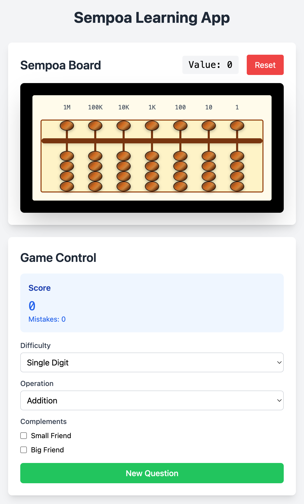

# Sempoa Learning App

An interactive sempoa/abacus learning application built with React, TypeScript, and Tailwind CSS.



## Features

### Sempoa Board
- Interactive 7-column sempoa board with authentic wooden bead appearance
- Proper place value headers (1M, 100K, 10K, 1K, 100, 10, 1) aligned with columns
- Click-to-toggle bead manipulation with authentic abacus behavior
- Drag and drop support for desktop
- Touch gesture support for mobile devices
- Real-time value calculation and display
- Visual feedback for bead positions

### Learning System
- Multiple difficulty levels: Single, Double, and Triple digit numbers
- Addition operations with various complexity levels:
  - Without complementary numbers
  - Using small friend only
  - Using big friend only
  - Using both small and big friends
- Subtraction operations with same structure as addition
- Mixed operations combining addition and subtraction
- Question generation system with appropriate difficulty progression

### Game Features
- Score tracking and mistake counting
- Visual feedback for correct/incorrect answers
- Configurable question types and difficulty settings
- Interactive game controller with real-time settings

## Getting Started

### Prerequisites
- Node.js (version 14 or higher)
- npm or yarn

### Installation

1. Clone the repository
2. Install dependencies:
```bash
npm install
```

3. Start the development server:
```bash
npm run dev
```

4. Open your browser and navigate to `http://localhost:5173`

### Build for Production

```bash
npm run build
```

## Usage

1. **Setup**: Configure your preferred difficulty level, operation type, and complement usage in the Game Control panel
2. **Generate Question**: Click "New Question" to start practicing
3. **Solve**: Use the sempoa board to calculate the answer by clicking/dragging beads
4. **Submit**: Click "Submit Answer" to check your solution
5. **Track Progress**: Monitor your score and mistakes in the Game Control panel

## Technology Stack

- **React 18** - UI framework
- **TypeScript** - Type safety and better development experience
- **Vite** - Fast build tool and development server
- **Tailwind CSS** - Utility-first CSS framework

## Project Structure

```
src/
├── components/              # React components
│   ├── SempoaBoard.tsx     # Main sempoa board component
│   ├── GameController.tsx  # Game control panel
│   └── DraggableBead.tsx   # Individual bead component
├── context/                # React context for state management
│   └── GameContext.tsx     # Game state management
├── types/                  # TypeScript type definitions
│   └── index.ts            # Type definitions for the app
├── utils/                  # Utility functions
│   └── questionGenerator.ts # Question generation logic
├── App.tsx                 # Main application component
├── main.tsx                # Application entry point
└── index.css               # Global styles and Tailwind imports
```

## Contributing

1. Fork the repository
2. Create your feature branch (`git checkout -b feature/AmazingFeature`)
3. Commit your changes (`git commit -m 'Add some AmazingFeature'`)
4. Push to the branch (`git push origin feature/AmazingFeature`)
5. Open a Pull Request

## License

This project is licensed under the MIT License.