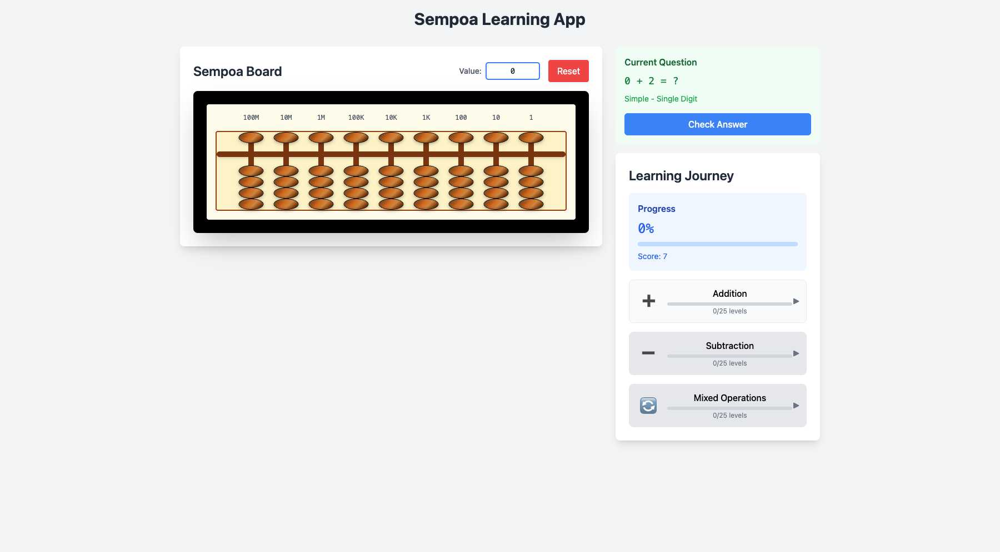

# Sempoa Learning App

An interactive sempoa/abacus learning application built with React, TypeScript, and Tailwind CSS.



## Features

### Interactive Sempoa Board
- 13-column sempoa board (displays 9 columns on mobile, 13 on desktop) with authentic wooden bead appearance
- Proper place value headers from 100 billion down to 1, aligned with columns
- Click-to-toggle bead manipulation with authentic abacus behavior:
  - Lower beads: clicking activates that bead and all above it
  - Upper beads: individual toggle behavior
- Drag and drop support for desktop interactions
- Touch gesture support optimized for mobile devices
- Keyboard input support for automatic bead positioning
- Real-time value calculation and display
- Audio feedback for bead interactions with configurable settings
- Visual feedback with smooth animations for bead positions

### Progressive Learning System
- **135 Total Levels**: Structured progression across 3 operations × 5 complement types × 9 digit levels
- **Operation Types**:
  - Addition with progressive complexity
  - Subtraction with same difficulty structure
  - Mixed operations combining addition and subtraction
- **Complement Integration**:
  - Simple operations (no complements)
  - Small friend usage (complement to 5)
  - Big friend usage (complement to 10)
  - Combined small and big friend operations
- **Difficulty Progression**: Single, double, and triple digit numbers with intelligent question generation
- **Learning Journey**: Visual progress tracking with level unlocking and completion percentages

### Progress & Feedback System
- **Progress Tracking**: Persistent user progress with localStorage integration
- **Scoring System**: Real-time score tracking and completion percentages
- **Visual Feedback**: Immediate feedback for correct/incorrect answers with color-coded responses
- **Audio Feedback**: Configurable sound effects for:
  - Bead interactions (different frequencies for upper/lower beads)
  - Answer correctness confirmation
  - Click feedback for UI interactions
- **Level Management**: Sequential level unlocking based on completion requirements
- **Session Persistence**: Automatic saving of progress and current game state

## Getting Started

### Prerequisites
- Node.js (version 14 or higher)
- npm or yarn

### Installation

1. Clone the repository
2. Install dependencies:
```bash
npm install
```

3. Start the development server:
```bash
npm run dev
```

4. Open your browser and navigate to `http://localhost:5173`

### Build for Production

```bash
npm run build
```

## How to Use

1. **Start Learning**: Begin with the first level in the Addition section of the Learning Journey
2. **Solve Questions**: Use the sempoa board to calculate answers:
   - Click beads to position them (authentic abacus behavior)
   - Use keyboard input for quick number entry
   - Drag and drop beads on desktop
3. **Submit Answers**: Click "Check Answer" to verify your solution
4. **Progress Through Levels**: Complete levels to unlock new challenges
5. **Track Achievement**: Monitor your progress, score, and completion percentages
6. **Audio Experience**: Enable audio feedback for immersive learning with bead sounds

## Technology Stack

- **React 18** - Modern UI framework with hooks and context
- **TypeScript** - Type safety and enhanced development experience
- **Vite** - Fast build tool and development server with HMR
- **Tailwind CSS** - Utility-first CSS framework for responsive design
- **Framer Motion** - Smooth animations for bead movements and UI transitions
- **Web Audio API** - Browser-native audio generation for feedback sounds
- **React Testing Library & Jest** - Comprehensive component testing
- **Playwright** - End-to-end testing for visual validation

## Project Structure

```
src/
├── components/              # React components
│   ├── SempoaBoard.tsx     # Main 13-column sempoa board
│   ├── DraggableBead.tsx   # Individual bead with interaction support
│   ├── QuestionDisplay.tsx # Question presentation and answer checking
│   ├── LearningJourney.tsx # Progress tracking and level selection
│   └── KeyboardInput.tsx   # Automatic bead positioning from keyboard
├── context/                # React context for state management
│   └── GameContext.tsx     # Centralized game state and progress
├── hooks/                  # Custom React hooks
│   ├── useGame.tsx         # Game state access hook
│   ├── useUserProgress.tsx # Progress management and persistence
│   ├── useAnswerChecking.tsx # Answer validation workflow
│   ├── useQuestionGeneration.tsx # Dynamic question creation
│   └── useKeyboardShortcuts.tsx # Keyboard input handling
├── utils/                  # Utility functions and managers
│   ├── questionGenerator.ts # Question generation logic
│   ├── audioFeedback.ts    # Audio feedback system
│   └── progressionManager.ts # Learning progression logic
├── config/                 # Configuration and constants
│   └── sempoaConfig.ts     # Visual and mathematical configuration
├── types/                  # TypeScript type definitions
│   └── index.ts            # Comprehensive type system
├── App.tsx                 # Main application component
├── main.tsx                # Application entry point
└── test-utils/             # Testing utilities and helpers
```

## Contributing

1. Fork the repository
2. Create your feature branch (`git checkout -b feature/AmazingFeature`)
3. Commit your changes (`git commit -m 'Add some AmazingFeature'`)
4. Push to the branch (`git push origin feature/AmazingFeature`)
5. Open a Pull Request

## License

This project is licensed under the MIT License.